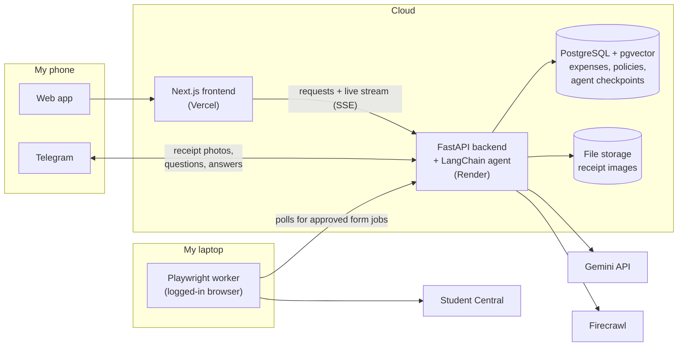

# Treasurer Agent

An AI agent that automates the repetitive parts of being a university student organization treasurer. It researches fundraising and conference funding, answers questions about registered student organization (RSO) policies, turns receipt photos into reimbursement-ready expense records, and fills out university funding forms. A human approves anything that gets submitted.

> **Status:** In active development. Phase 0 (the core agent) is complete. See the [roadmap](#roadmap).

## Why I'm building this

As a student organization treasurer, I spend a lot of time on repetitive work: reading receipts, checking purchases against funding rules, re-entering the same details into university forms, and searching for funding sources. This project hands that work to an LLM agent, while keeping a person in control of anything involving money.

## What it does

| Capability | How it works | Status |
|---|---|---|
| **Funding research** | Finds fundraising ideas and conference funding (travel grants, sponsorships) using Firecrawl web search and scraping, and cites its sources | Prototype |
| **Policy Q&A** | Answers questions about RSO funding rules using retrieval-augmented generation (RAG) over the university's policy documents | Planned |
| **Receipt processing** | Reads receipt photos with Gemini's image understanding, interprets cryptic item codes, checks the totals, and records each expense | Planned |
| **Human review** | When it's unsure (an unreadable item code, a possible policy violation), the agent messages me on Telegram, waits for my answer, then continues | Planned |
| **Form filling** | Fills out funding and reimbursement forms on Student Central with Playwright; I review and submit | Planned |
| **Live agent view** | A web app that streams the agent's steps and tool calls in real time | Planned |

## Architecture



- **Agent:** a single LangChain agent (`create_agent`, which builds a LangGraph graph) that uses the tools listed below. One agent with well-described tools is easier to debug and evaluate than several cooperating agents.
- **Backend:** FastAPI runs the agent, streams each step to the frontend with Server-Sent Events, and receives Telegram messages through a webhook.
- **Data:** one PostgreSQL database holds expenses, receipt records, saved agent state (so a paused run can resume hours later), and policy embeddings (via pgvector).
- **Form-filling worker:** runs on my laptop, not in the cloud. It checks the backend for approved form jobs, then uses a browser session I've already logged into. Because the worker makes all the connections itself, the laptop never has to accept connections from the internet.

### Agent tools

| Tool | Purpose | Requires my approval |
|---|---|---|
| `research_web` | Search and scrape trusted sources with Firecrawl | No |
| `search_policies` | Retrieve relevant RSO policy passages | No |
| `parse_receipt` | Extract structured line items from a receipt image | No |
| `lookup_item_code` | Search the web to identify an unrecognized item code | No |
| `ask_treasurer` | Message me on Telegram and wait for a reply | n/a |
| `record_expense` | Save a validated expense | No |
| `submit_form_job` | Queue a Student Central form for the worker | **Yes** |

## Design decisions

1. **A person approves every submission.** The agent can prepare forms, but LangChain's human-in-the-loop middleware pauses before `submit_form_job`, and I make the final click on Student Central myself.
2. **University credentials never touch the app.** Student Central uses university single sign-on with multi-factor authentication. Instead of storing a password, the Playwright worker reuses a browser profile I logged into myself, and it only runs on my machine.
3. **Math is done in code, not by the model.** The LLM extracts line items, and Python checks that the items, tax and total add up. A mismatch sends the receipt to human review.
4. **Web content can't trigger actions.** Crawled pages can contain text written to manipulate an LLM (prompt injection). Research results are treated only as information, and every tool that submits anything requires approval.
5. **Answers are cited and actions are logged.** Research and policy answers cite their sources, every agent run is traced in LangSmith, and every expense links back to its original receipt.
6. **Personal data is minimized.** Receipts can include names and partial card numbers. These are redacted with LangChain's PII middleware before anything is stored or logged.

## Tech stack

| Layer | Technology |
|---|---|
| LLM | Google Gemini API (Flash models; image input for receipts) |
| Agent framework | LangChain 1.x (`create_agent`), LangGraph |
| Structured output | Pydantic |
| Web research | Firecrawl |
| Browser automation | Playwright (Python) |
| Backend | FastAPI |
| Frontend | Next.js, React, TypeScript |
| Database | PostgreSQL + pgvector (Supabase) |
| Messaging | Telegram Bot API |
| Observability | LangSmith |
| Hosting | Vercel (frontend), Render (backend), local machine (Playwright worker) |

Implemented so far: Gemini API, LangChain and Pydantic. The rest is the planned stack for later phases.

## Roadmap

- [x] **Phase 0: Core agent.** LangChain agent on Gemini with tool calling and structured Pydantic output.
- [ ] **Phase 1: Receipt processing.** Receipt image to validated line items, item-code interpretation, confidence flags, and an evaluation set of real receipts.
- [ ] **Phase 2: Policy RAG.** Load RSO policies into pgvector, answer questions with citations, and check expenses against policy.
- [ ] **Phase 3: Funding research.** Firecrawl research for fundraising and conference funding, with cited sources.
- [ ] **Phase 4: Backend and live UI.** FastAPI and Next.js with streamed agent steps, PostgreSQL storage, and LangSmith tracing.
- [ ] **Phase 5: Human in the loop.** Telegram bot for sending receipt photos and answering the agent's questions; runs pause and resume across conversations.
- [ ] **Phase 6: Student Central forms.** A local Playwright worker fills forms from approved jobs.
- [ ] **Phase 7: Deploy and evaluate.** Hosted deployment, accuracy evaluations, and cost and rate limits.

## Getting started

Current setup (Phase 0):

```bash
git clone https://github.com/PoshLizard/treasurerAgent.git
cd treasurerAgent
python -m venv venv
venv\Scripts\activate            # Windows; on macOS/Linux use: source venv/bin/activate
python -m pip install -r requirements.txt
```

Create a `.env` file in the project root:

```
GOOGLE_API_KEY=your-key-from-aistudio.google.com
```

Then run:

```bash
python main.py
```

## Planned project structure

```
treasurerAgent/
├── backend/      # FastAPI app, agent, tools, RAG, Telegram bot
├── worker/       # Playwright Student Central worker (runs locally)
├── frontend/     # Next.js app
├── evals/        # test receipts and expected results
└── LEARNING.md   # build log
```

## Build log

[LEARNING.md](LEARNING.md) records what I built at each step and what I learned along the way.
